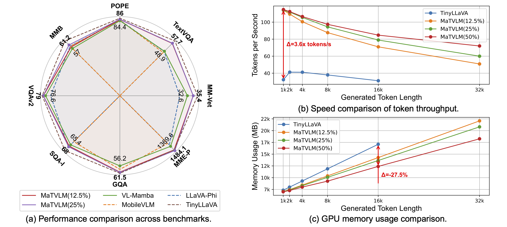

<div align="center">
<h1>MaTVLM 
</h1>

<h3>MaTVLM: Hybrid Mamba-Transformer for Efficient Vision-Language Modeling</h3>

[Yingyue Li](https://github.com/Yingyue-L)<sup>1</sup>, [Bencheng Liao](https://github.com/LegendBC)<sup>2,1</sup>, [Wenyu Liu](https://eic.hust.edu.cn/professor/liuwenyu/)<sup>1</sup>, [Xinggang Wang](https://xwcv.github.io/)<sup>1 :email:</sup>
 
<sup>1</sup>  School of EIC, HUST

<sup>2</sup> Institute of Artificial Intelligence, HUST

(<sup>:email:</sup>) corresponding author.

[](https://arxiv.org/abs/)&nbsp;
[](https://github.com/hustvl/MaTVLM)&nbsp;
[](https://huggingface.co/hustvl/MaTVLM_0_25_Mamba2)&nbsp;


</div>


## Abstract
With the advancement of RNN models with linear complexity, the quadratic complexity challenge of transformers has the potential to be overcome. Notably, the emerging Mamba-2 has demonstrated competitive performance, bridging the gap between RNN models and transformers. 
However, due to sequential processing and vanishing gradients, RNN models struggle to capture long-range dependencies, limiting contextual understanding. This results in slow convergence, high resource demands, and poor performance on downstream understanding and complex reasoning tasks. 
In this work, we present a hybrid model MaTVLM 
by substituting a portion of the transformer decoder layers in a pre-trained VLM with Mamba-2 layers. Leveraging the inherent relationship between attention and Mamba-2, we initialize Mamba-2 with corresponding attention weights to accelerate convergence. Subsequently, we employ a single-stage distillation process, using the pre-trained VLM as the teacher model to transfer knowledge to the \name, further enhancing convergence speed and performance. Furthermore, we investigate the impact of differential distillation loss within our training framework.
We evaluate the MaTVLM on multiple benchmarks, demonstrating competitive performance against the teacher model and existing VLMs while surpassing both Mamba-based VLMs and models of comparable parameter scales. Remarkably, the MaTVLM achieves up to $3.6\times$ faster inference than the teacher model while reducing GPU memory consumption by 27.5\%, all without compromising performance.

<div align="center">

</div>

<!-- ## [Main Results](docs/Results.md)

## Getting Started -->
## Contents

- [Install](#install)
- [Demo](#demo)
- [Prepare data](#prepare-data)
- [Train](#start-training)
<!-- - [Evaluation](docs/Evaluation.md) -->


### Install

1. Clone this repository and navigate to MaTVLM folder
```bash
git clone https://github.com/hustvl/MaTVLM
cd MaTVLM
```

2. Install Package
```Shell
# Install PyTorch (with CUDA 11.8) before everything else. those assume you are using cu118
conda create -n matvlm python=3.10 -y
conda activate matvlm
pip install torch==2.1.1 torchvision==0.16.1 torchaudio==2.1.1 --index-url https://download.pytorch.org/whl/cu118
pip install -r requirements.txt
wandb login
```

#### Gradio Interface

Run the following command:

```bash
python -m serve.app --model-path hustvl/MaTVLM_0_25_Mamba2
```

### Prepare data

Please refer to the [document](https://tinyllava-factory.readthedocs.io/en/latest/Prepare%20Datasets.html#id2) of the [TinyLLaVA](https://github.com/TinyLLaVA/TinyLLaVA_Factory) to download the ShareGPT4V Dataset.

### Start training!

```
CUDA_VISIBLE_DEVICES=0,1,2,3 ACCELERATE_LOG_LEVEL=info PYTHONPATH=. accelerate launch --main_process_port=9999 --config_file multi_gpu.yaml train_tinyllava_mamba2/train_hybrid.py mamba2_tinyllava/tinyllava_0.25_mamba2_665k.yaml 2>&1 | tee -a output_train.txt
```
It takes around 48 hours for MaTVLM_0.25_mamba2_TinyLLaVA-3.1B on 4x 3090 (24G).


## Acknowledgements
This code is developed on the top of [TinyLLaVA](https://github.com/TinyLLaVA/TinyLLaVA_Factory), [MambaInLLaMA](https://github.com/jxiw/MambaInLlama). Thanks for their great works.

## Citation
If you find MaTVLM is useful in your research or applications, please consider giving us a star 🌟 and citing it by the following BibTeX entry.

```bibtex
 @article{,

}
```